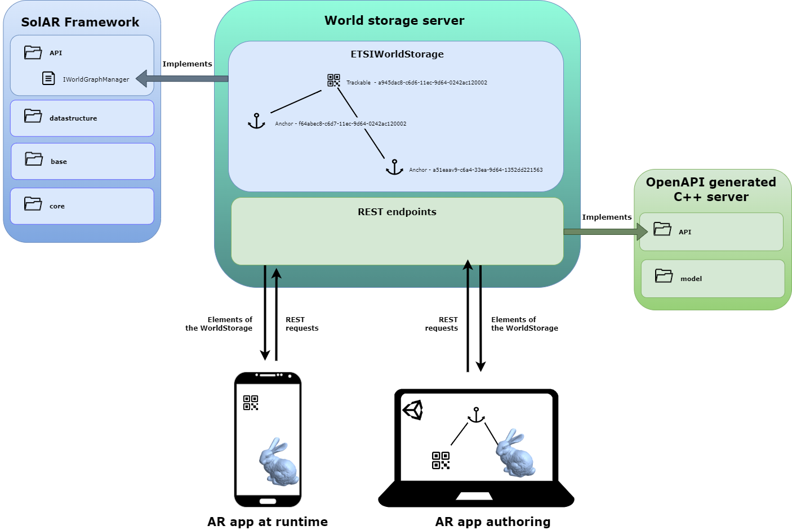
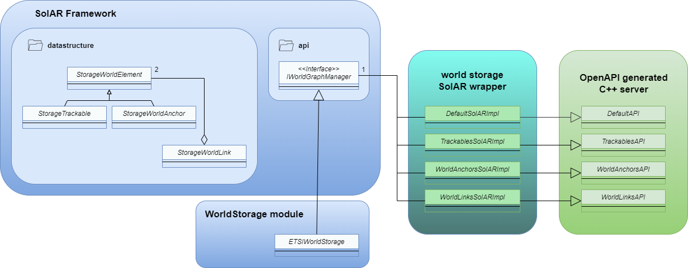

# <ins>SolARWorldStorage</ins>
## <ins>Server implementation using the SolAR world storage module</ins>

The goal of the world storage server is to be able to store and fetch online all the elements needed to design and execute AR apps.
This server implements a [server partially generated by OpenAPI generator](https://labs.etsi.org/rep/arf/world-storage-api-helpers/world-storage-cpp-server.git), based on the ETSI specification and handles REST requests designed in the same ETSI specification file, [available on the ETSI forge](https://forge.etsi.org/rep/arf/arf005/-/blob/develop/API/openapi.yaml).
It uses the ETSIWorldStorage component of the Solar world storage module ([SolARModuleWorldStorage]((https://github.com/SolarFramework/SolARModuleWorldStorage/tree/develop))) as an implementation for SolAR framework's [IWorldGraphManager](https://github.com/SolarFramework/SolARFramework/blob/feature/WorldGraph/interfaces/api/storage/IWorldGraphManager.h).  

 
For each Tag that we explicitly define in our API specification, OpenAPI will generate a corresponding interface able to handle all the requests specific to that tag. All that is left to do is to implement them and define the desired behavior as a response in the methods.
All the classes in this project (except for the main and UnitSysConversion) are implementation of the interfaces generated by OpenAPI.  

  

Except for the `DefaultSolARImpl` class, that only has usages for when you want to check if the server is up and check the version, all of the request handling classes have the world storage singleton as an attribute. On which they will be able to call methods in response to requests.
The module is passsed down through the constructor to ensure the uniqueness of it.

## <ins>How to</ins>

To be able to compile and run this server, you need to:
- clone [the OpenAPI world storage](https://labs.etsi.org/rep/arf/world-storage-api-helpers/world-storage-cpp-server.git) project and then generate the code and export it as a library (follow the git's instructions)
- have [remaken](https://github.com/b-com-software-basis/remaken) installed
- clone [SolAR framework](https://github.com/SolarFramework/SolARFramework) (for now, as the work is not released yet, you will have to clone the [feature/WorldGraph](https://github.com/SolarFramework/SolARFramework/tree/feature/WorldGraph) branch), perform a `remaken install` in the source directory and finally build the project
- clone [the world storage module](https://github.com/SolarFramework/SolARModuleWorldStorage) (for now, as the work is not released yet, you will have to clone the [develop](https://github.com/SolarFramework/SolARModuleWorldStorage/tree/develop) branch) and build it

Once all those requirements are met, you should be able to compile your server and run it, you can try and send requests to http://localhost:8080 to try and see if it's working (e.g. POST request to see if the server is up : http://localhost:8080/ping)