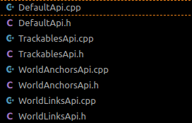
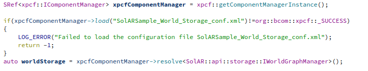
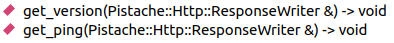
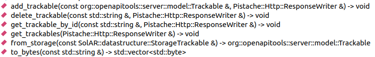
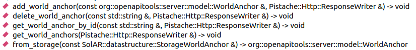
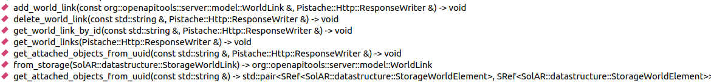
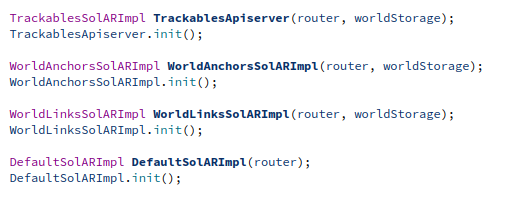

# <ins>SolARWorldStorage</ins>
## <ins>Server implementation using the SolAR world storage module</ins>

This server handles REST requests designed in the ETSI specification file, [available on the ETSI forge](https://forge.etsi.org/rep/arf/arf005/-/blob/develop/API/openapi.yaml).

It relies on two libraries:
- The library generated by the OpenAPI generator project. ([git repository](https://labs.etsi.org/rep/arf/world-storage-api-helpers/world-storage-cpp-server.git))
- The world storage, a SolAR module used to store the different items needed to create an AR app ([git repository](https://github.com/SolarFramework/SolARModuleWorldStorage/tree/develop))

  
##<ins>I - OpenAPI project</ins>

This project is the direct implementation of the server classes generated by the [OpenAPI generator ETSI project](https://labs.etsi.org/rep/arf/world-storage-api-helpers/world-storage-cpp-server.git) from the [API specification file](https://forge.etsi.org/rep/arf/arf005/-/blob/develop/API/openapi.yaml). 
For each tag attribute that we defined in our specification (i.e "default", "trackable", "world anchor" and "world link"), OpenAPI generates classes handling the requests specific to that tag (one method generated per request specified).

The OpenAPI project also generates model classes for our specified objects (e.g Trackables, WorldAnchors...).

All of this project is exported as a library for us to use and augment in our wrapper. More info can be found in the project's git.

Although we won't be using them, OpenAPI also generates basic implementation of the API endpoints classes and a main class to run your server instantly.

##<ins>II - SolAR module</ins>

**SolAR architecture**

By SolAR standards, a module is a collection of components. Components are implementations of SolAR interfaces. 
Our wrapper uses the world storage module, a singleton instantiated by the XPCF component manager, a SolAR tool.

It has a component that dynamically stores `Trackables`, `Anchors` and `Links` and implements the methods of the world graph manager, a SolAR interface. These methods allow for interaction with the stored elements. These elements are specified in the SolAR framework itself in the datastrucutre folder.
|  **datastructure**  |                                                                  **description**                                                                  |
|:-------------------:|:-------------------------------------------------------------------------------------------------------------------------------------------------:|
|   `StorageWorldLink`  | A Link between two `StorageWorldElement`, it holds the information of both elements and the transform between them                                  |
| `StorageWorldElement` | The abstract type used to describe the elements that we want to store in our world storage. It holds all the common attributes to those elements. |
|   `StorageTrackable`  | (inherits `StorageWorldELement`) A trackable that will be stored in the world storage                                                               |
|  `StorageWorldAnchor` | (inherits `StorageWorldELement`) A world anchor that will be stored in the world storage                                                            |

Each datastructure is described in detail in the [SolAR git repository](https://github.com/SolarFramework/SolARFramework).

**Module world storage**

The module in itself has three attributes used to store information:
        
- **m_nodes** : `map<uuid,  shared_ptr<StorageWorldElement>>`
  - The map that holds all of the elements in the world storage, it stores their id as keys for performance purposes.
- **m_tags** : `multimap<pair<string, string>, shared_ptr<StorageWorldElement>>`
  - A multimap that allows for research by the `tag`, a `StorageWorldElement` attribute that widens the capacity of customisation. It consists of a pair of string {key;value}.
- **m_links** : `map<uuid, shared_ptr<StorageWorldLink>>`
  - The map that holds all of the information regarding relations between each element.

Each datastructure is stored dynamically with the usage of `shared_ptr`.

**Method calls**

All the methods of the world storage return a `FRAMEWORK_RETURN_CODE`, a SolAR enum to standardize and store responses from methods. most of them will return  
- `FRAMEWORK_RETURN_CODE::_SUCCESS` when the method executes succesfuly
- `FRAMEWORK_RETURN_CODE::_ERROR__` when an error is raised  
- `FRAMEWORK_RETURN_CODE::_NOT_FOUND_` when ressources that need to be fetched are not available.

Most of the methods implemented by the module are described in the [project README](https://github.com/SolarFramework/SolARModuleWorldStorage/tree/develop#readme)

##<ins>III - Wrapper architecture

**OpenAPI inheritance**

For the endpoints, we have to make new classes that inherit those generated by OpenAPI and override their handle methods in order to be able to correcly answer REST requests.
For now we have four child classes :
- `DefaultSolARImpl`
- `TrackablesSolARImpl`
- `WolrdAnchorsSolARImpl`
- `WorldLinksSolARImpl`
  
Here are the methods associated to each endpoint :

|     Class    |         Methods                                    |
|:------------:|:--------------------------------------------------:|
|    `DefaultApi.h`   |       |
|   `TrackableApi.h`  |   |
| `WorldAnchorApi.h` |         |
|  `WorldLinkApi.h`  |             |

For all those methods, the `Pistache::Http::ResponseWriter` is a [out] param that allows the user to give the response back to the REST request.

Except for the `DefaultSolARImpl` class, that only has usages for when you want to check if the server is up and check the version, all of those classes have the world storage singleton as an attribute. On which they will be able to call methods in response to requests.
The module is passsed down through the constructor to ensure the uniqueness of it.

**Default methods**
 **`get_ping` | `get_version`** 
These two methods are associated to the "Default" endpoint and serve the purpose of indicating the server's state.

**add_X**
 **`add_trackable` | `add_world_anchor` | `add_world_link`** 
These methods are used for all the models that we want to preserve in our storage. As an argument, you receive the object you want to add. Its type is of the model type defined in the API specification. The verification of the object's integrity is already done in the OpenAPI generated library. 
In our SolAR wrapper we perform a conversion between the two types that we use (OpenAPI model and SolAR datastructure) and then call the module's add method corresponding to the element in question to add it to the world storage.
For the `add_world_link`, we also added a verification that the two elements it connects are present in the world storage prior to the request reception.
When the user performs a REST request to add an element, he gets as a response the ID of the newly added element.

**delete_X**
 **`delete_trackable` | `delete_world_anchor` | `delete_world_link`** 
Those are the methods you call when you want to delete an element from the world storage. The methods receive a UUID (unique identifier) as a `String` argument, convert it to the `UUID` type (from the boost library) and pass it to the module's delete method.
When the user performs a REST request to remove an element, he gets as a response a confirmation that the element is deleted (or not).

**get_X_by_id**
 **`get_trackable_by_id` | `get_world_anchor_by_id` | `get_world_link_by_id`** 
The logic is the same as the delete methods: we get a `String` UUID, convert it to `UUID` type and pass it to the module's get method.
The module's method returns a SolAR datastructure on which we call the `from_storage` method to convert it to the OpenAPI model. Then we can translate it into a JSON thanks to the `to_json` method generated by OpenAPI. We return this JSON to the user who sent the request.

**get_Xs**
 **`get_trackables` | `get_world_anchors` | `get_world_links`** 
These methods return all the elements (of a given type) present in the world storage. We call the module's get_Xs method that returns a vector. For each element of this vector we add it to a JSON array that will be sent back to the user.

**get_attached_objects_from_uuid**
 **`get_attached_objects_from_uuid`** 
This method receives as an argument a link Id, fetches it from the world storage via the module's `getWorldLink` method. Then we look at the two elements it connects and put their info into a JSON that we send back to the user.

**Utility methods**
 **`from_storage` | `to_bytes`** 
These methods do not override methods from the OpenAPI generated library, they are here to help handle models/datastructures. `from_storage` converts a SolAR datastructure into an OpenAPI model, `to_bytes` is only used to convert the `Trackable`'s payload attribute from a `String` into a vector of bytes.

**Main**

The main.cpp class being already generated by OpenAPI, we just have to modify it to match what we want for our server. After setting up the world storage module, we need to set up our endpoints classes.

Once it's done, the rest of the generated code sets up everything up and waits for REST requests on http://localhost:8080.

